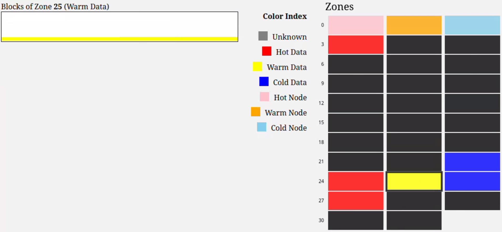

# bpf-f2fs-zonetrace

ZoneTrace is an eBPF-based program that can visualize the space management of each zone on F2FS on ZNS SSDs in real-time without any kernel modification. We believe ZoneTrace can help users analyze F2FS with ease and open up several interesting research topics on ZNS SSDs.

# Quick Start

> ⚠️ This project is still in the early stage of development. Please contact us if you have real ZNS SSDs and want to try ZoneTrace. We will help you to set up the environment and test ZoneTrace. For now, we only tested on the FEMU environment.

## Host Machine Requirements

- Only Debian/Ubuntu based distributions supported (for FEMU)
- 8+ cores, 12GB+ RAM (for emulating 4GB NVMe ZNS SSDs)
- 20GB+ disk space

1. Prepare the FEMU environment

    We provide a pre-built Debian 12 qcow2 image for FEMU. You can download it from [here](https://personalmicrosoftsoftware-my.sharepoint.com/:u:/g/personal/pingxiac_personalmicrosoftsoftware_uci_edu/EbSON0cUewhFgugceuFiAAQBRpy4hm4x1oZP0uZie6_CgA?e=qRUw8a).

    and then put the image into the `$HOME/images`.

    ```bash
        mkdir -p $HOME/images
        mv debian.qcow2 $HOME/images
    ```

2. Run script `./run_femu.sh` to build and run FEMU.
    If you build FEMU for the first time, it will take a long time to build qemu and FEMU. (FEMU repo: [link](https://github.com/vtess/FEMU))

    ```bash
        ./run_femu.sh
    ```

    FEMU exposes ssh port 8080. You can login from the host to FEMU with ssh. (The default username and password are `femu` and `femu`, respectively.)

    ```bash
        ssh -p 8080 femu@localhost
    ```

   > ⚠️ All quickstart guide below assumes that you are in the FEMU environment with our pre-built Debian 12 image. If you use your own VM image, you need to install the dependencies and build the tools on your own. See [How to Build](#how-to-build) for more details.

3. Clone the repo in FEMU

    ```bash
        cd $HOME
        git clone https://github.com/pingxiang-chen/bpf-f2fs-zonetrace.git
    ```

4. Mount the ZNS device with the F2FS filesystem and run the tracer & viewer
    
    > ⚠️ WARNING: The script `./scripts/mount_f2fs` will format the ZNS device `/dev/nvme0n1` with the F2FS filesystem. Please make sure that you have backed up the data on the ZNS device.

    ```bash
        cd $HOME/bpf-f2fs-zonetrace
        sudo ./scripts/mount_f2fs.sh
        sudo ./scripts/run_tracer.sh
    ```

    The default mount point is `/mnt/f2fs`. You can change the mount point by setting the `MOUNT_POINT` variable in `./scripts/mount_f2fs.sh`.

5. Open the viewer in your browser

    When you run the `./scripts/run_tracer.sh`, you can see the `======== Running on http://0.0.0.0:9090 ========` message in the terminal.
    
    Because the viewer is running in FEMU, you need to forward the port 9090 to the host machine. You can use the following command.

    ```bash
        ssh -p 8080 -L 9090:localhost:9090 femu@localhost
    ```

    Then you can open the viewer in your host machine browser with the following URL.
    
    http://localhost:9090

6. Do some operations on the F2FS filesystem mount point.

    You can do some operations on the F2FS filesystem. For example, you can use our pre-defined fio jobfile.

    ```bash
        sudo apt -y install fio
        sudo fio ./job.fio
    ```

    Then you can see the trace data in the viewer.

    


# How to Build

## Custom FEMU Image

You can use your own VM image. But you need to satisfy the following VM image requirements:
- [libbpf BTF requirements](https://github.com/pingxiang-chen/bpf-f2fs-zonetrace/tree/main/bpftool/libbpf#bpf-co-re-compile-once--run-everywhere) (Linux Kernel built with `CONFIG_DEBUG_INFO_BTF=y` and `CONFIG_DEBUG_INFO_BTF_MODULES=y` option for BTF support)
- [NVME ZNS SSD Support](https://zonedstorage.io/docs/linux/config) (Linux Kernel built with `CONFIG_BLK_DEV_ZONED=y` and `CONFIG_NVME_CORE` option)
- [FEMU ZNS requirements](https://github.com/vtess/FEMU#installation) (Linux kernel 5.10+ for emulating ZNS device with FEMU)

You also need to change the `IMAGE_DIR` and `IMAGE_FILE` variables properly in `run_femu.sh` to your own VM image path.


## Build f2fs-tools on FEMU

1. Install dependencies


    ```bash
        sudo apt install uuid-dev autoconf libtool libselinux1-dev
    ```

2. Build our modified f2fs-tools

    ```bash
        cd $HOME/bpf-f2fs-zonetrace/f2fs-tools
        ./autogen.sh
        ./configure
        make
        make install # optional
    ```
    > ❗ When you run the `./configure`, "checking for struct blk_zone.capacity" should be yes. If not, you need to check whether your kernel version is 5.10+ and whether your kernel is built with `CONFIG_BLK_DEV_ZONED=y` option. If you already have a proper kernel, you can try to run `sudo make headers_install` to install the kernel headers and then run `./configure` again.

## Build bpftool

Follow the [bpf-f2fs-zonetrace/bpftool/libbpf/README.md](https://github.com/pingxiang-chen/bpf-f2fs-zonetrace/blob/main/bpftool/README.md) to install the bpftool. It is the same as the original bpftool, pinned to version 7.2.

## Build the tracer and viewer

1. Dump the BTF of f2fs from the kernel to the BPF program source code directory.

    ```bash
        cd $HOME/bpf-f2fs-zonetrace/bpftool
        bpftool btf dump file /sys/kernel/btf/f2fs format c > $(HOME)/bpf-f2fs-zonetrace/src/bpf/f2fs.h
    ```

2. Build the tracer

    ```bash
        cd $HOME/bpf-f2fs-zonetrace/src/bpf
        make -j
    ```

8. Build the viewer with Golang(>=1.16)

    Follow the Golang installation guide [here](https://golang.org/doc/install).

    and then build the viewer
    ```bash
        cd $HOME/bpf-f2fs-zonetrace/src/viewer
        go build
    ```

# License
BSD 2-Clause License
